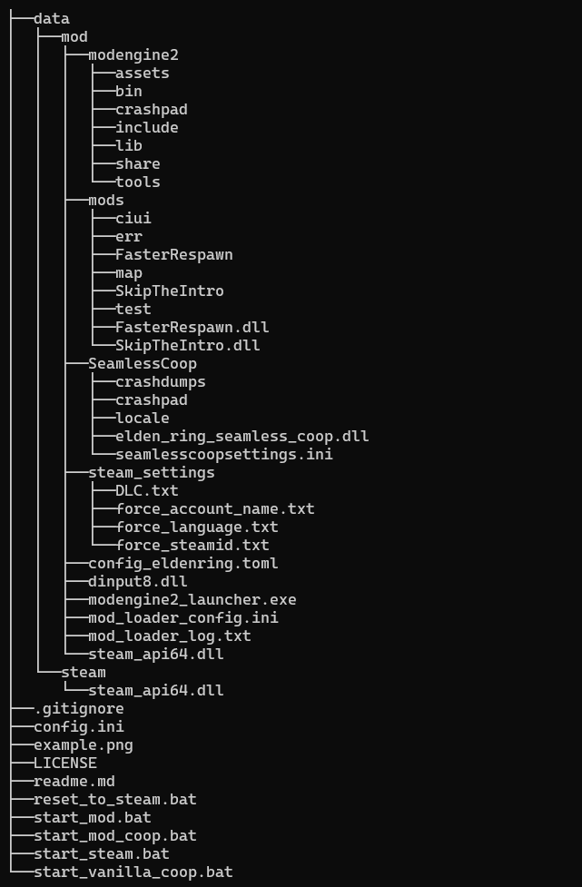

## Elden Ring 多模式快速启动

## 介绍

|          程序          |                               功能                               |
| :----------------------: | :----------------------------------------------------------------: |
|   reset_to_steam.bat   |                清除所有mod相关文件，恢复正版状态                |
|     start_mod.bat     | 启动游戏并加载全部mod，包括普通mod及dll类mod，但不会启动无缝联机 |
|    start_steam.bat    |                   以steam方式启动，与正版一致                   |
|   start_mod_coop.bat   |    启动游戏并加载全部mod，包括普通mod及dll类mod，以及无缝联机    |
| start_vanilla_coop.bat |                启动无缝联机，但不加载其他任何mod                |

## 安装

1. 将此项目下载到与Elden Ring相同的磁盘分区（例如D:）
2. 修改`config.ini`中的路径为你Elden Ring的位置，最后一个斜杠需要保留
3. 备份原版`steam_api64.dll`到`./data/steam/`
4. 将所有添加的模组与相关文件放入`./data/mod/`；如果你用[goldberg_emulator](https://gitlab.com/Mr_Goldberg/goldberg_emulator)来实现局域网联机，那你也需要将局域网用的`steam_api64.dll`放入这里。

## 卸载

运行一次`reset_to_steam.bat`，然后删除此文件夹

## 示例

这是我的配置，我修改了modenginede路径配置，不修改也不会影响

